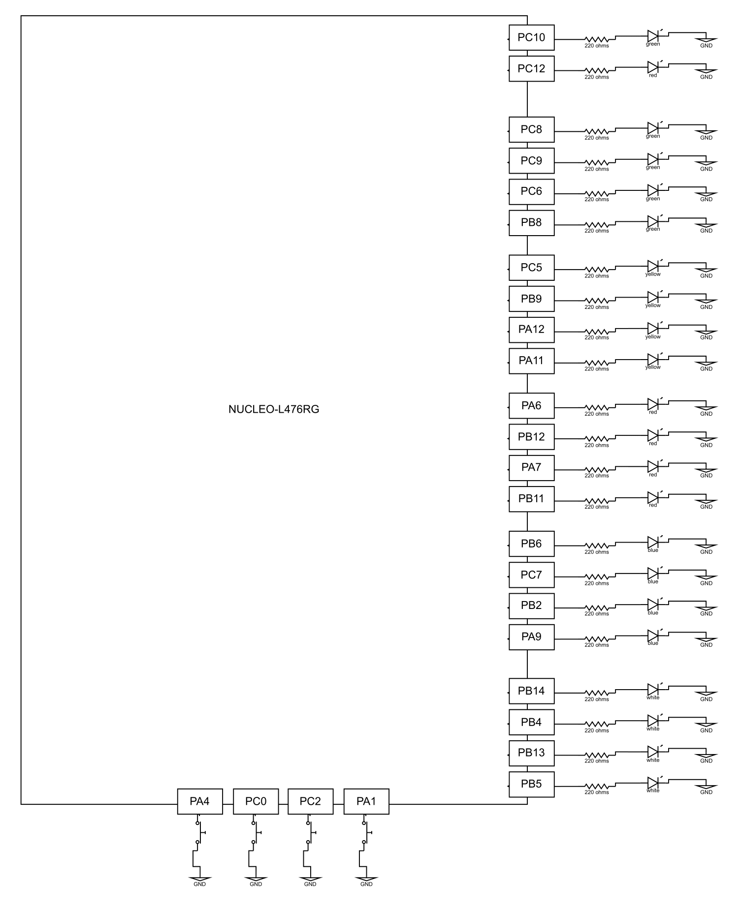

# Embedded Simon Says 

A faithful recreation of the classic **Simon memory game**, built entirely on STM32 using LEDs and buttons.

## Overview
**Embedded Simon Says** recreates the iconic memory game using the **STM32L476RG microcontroller**. It features **two distinct gameplay modes**. Perfect for practicing pattern recognition or just testing your memory.

### Learning Mode 
Designed to help players **memorize and study** patterns at their own pace. 
  - Players can **view the entire pattern** from the start
  - **Unlimited attempts** at recreating the pattern, no penalties for mistakes
  - Goal: **Master the sequence**

### Challenge Mode
Designed to **test** the player’s memory. 
  - Players must replicate an **increasingly complex pattern**
  - One **mistakes end the gane**
  - Each succesful round lights up **2 progress LEDs**, up to 16 total
  - Goal: **Complete 8 rounds** to fully light all 16 LEDs on the scoreboard

## Demo
<table>
  <tr>
    <td>
      
    </td>
  </tr>
  <tr>
    <td><strong>Gameplay & Features Showcase</strong></td>
  </tr>
</table>

## Features
✅ Two Gameplay Modes
 - Learning: View full sequence for training
 - Challenge: Authentic Simon experience with growing pattern length

🧠 Four Unique Patterns
 - Each offering a different level of complexity

🔁 Instant Mode & Pattern Switching
 - *Tap* the USER button to switch patterns
 - *Hold* the USER button to change between modes

🕹️ Interrupt-Based Input Handling
 - External interrupts on PA1, PA4, PC0, PC2, and PC13
 - Software debouncing ensures clean button logic

⏱️ Precise Timing
 - TIM2 for animations
 - SysTick for general timekeeping and delays
 
💡 LED-Centric Visual Interface
 - 16-LED scoreboard displays progress at the end of a game (Challenge Mode)
 - 4 white indicator LEDs show mode transition and active pattern
 - Green LED signals when input is expected
 - Red LED signals an incorrect input

## Hardware Requirements
- STM32 NUCLEO-L476RG development board
- 22 external LEDs:
  - 4 white LEDs
  - 4 blue LEDs
  - 4 yellow LEDs
  - 4 + 1 red LEDs  
  - 4 + 1 green LEDs
- 4 pushbuttons (connected to PA1, PA4, PC0, and PC2)
- Breadboard and jumper wires
- USB cable for power and flashing via ST-Link

## Block Diagram
 

